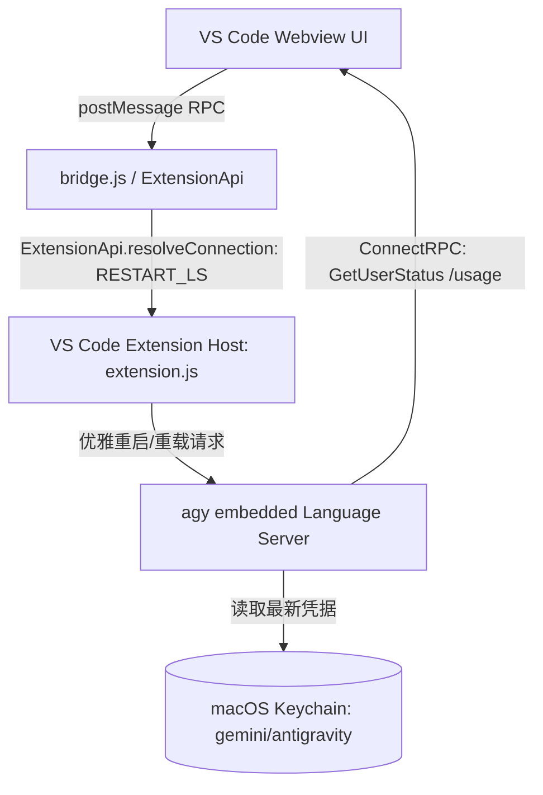

# Google Antigravity VS Code 多账号增强实验设计

状态：实验设计，非多账号架构权威源。当前代码尚未完成本文描述的 `RESTART_LS` 闭环。跨项目职责、认证载体和已验收能力以 `agent-hub-accounts` 文档为准。

## 1. 核心设计目标

目标是研究 `antigravity-ls` 语言服务与 VS Code 宿主扩展的内部协议，评估 **“Keychain 原子覆写 + 官方 RPC 优雅重载（`RESTART_LS`）”** 能否形成 IDE 内嵌的平滑多账号切换。当前源码只完成 UI 注入和 Accounts CLI 桥接，尚未完成并验证整个链路。

---

## 2. 底层通讯与服务架构

### 2.1 进程与协议全景


### 2.2 关键底层机制
1. **一体化架构（Embedded Single Binary）**：
   - 核心服务统一内嵌于 `~/.gemini/bin/agy`（~177 MB Mach-O）；
   - `--hub` 端口同时暴露 Webview HTTP 与 ConnectRPC 服务。
2. **官方优雅重载协议**：
   - 官方定义：`Po.resolveConnection({ type: W.ConnectionResolutionType.RESTART_LS })`；
   - 避免操作系统级硬杀进程（`pkill`）导致的 WebSocket 隧道断开与卡 Loading。

---

## 3. 目标切号流水线

> ⚠️ **本节是早期设想,其中第 3 步从未实现,不要照此理解现状。** 实际实现见 [`FLOWS.md`](./FLOWS.md) 场景 2。
>
> 设想的第 3 步是"派发 `resolveConnection({ RESTART_LS })` 让 agy 重新读 Keychain"。实际做不到:`agy --hub` 只在**进程启动时**绑定一次 `AuthProvider`,没有任何运行中重读凭证的机制(给它发 SIGHUP 会被直接忽略,实测验证过)。所以真实做法是**换掉进程**。

实际流水线:

```text
1. UI 点击目标账号 → 确认框 → 进度遮罩
2. agent-hub-accounts switch <id>     仅覆写 Keychain Active Slot(~150ms)
3. daemon 先回 HTTP 响应,再重启 hub   顺序不能反,理由见 FLOWS.md
4. SIGTERM 旧 hub → 等退出 → 同端口自行 respawn → reload 内容 iframe(~7s)
5. iframe 重载即完成信号,进度遮罩随文档一起消失
```

---

## 4. 异常处理与自愈保障

1. ~~**Token 有效性前置校验**~~ —— **未实现**。切号前不做静默校验;`eligibility_failed` 等状态只在 UI 上展示,不阻断切换。
2. **自动回滚机制** —— **已实现**,但不是设想的形式:daemon 调用失败时由前端把本地状态回滚到切换前的账号并提示,避免"UI 显示已切换、后端其实没切"。
3. **孤儿 hub 回收** —— **已实现**(设计时未预见):同端口 respawn 后若插件又自行拉起一个 hub,daemon 每 30s 按"没有任何 iframe 引用该端口"回收多余进程。

---

## 5. 项目工程结构与文件分工

| 文件模块 | 路径 | 核心职责 |
| :--- | :--- | :--- |
| **底层管理引擎** | `src/daemon/accounts/` | Keychain 凭证管理、`switch` 账号切换、`quota` 配额轮询 |
| **UI 弹窗组件** | `src/runtime/ui/accountPopup.ts` | 1:1 磨砂多账号切换浮窗 |
| **设置页增强** | `src/runtime/ui/settingsEnhancer.ts` | Settings 页面 Models & Usage 看板注入 |
| **强逻辑定位器** | `src/runtime/adapters/semanticLocator.ts` | 语义 AST 特征节点回溯与绝对贴靠定位 |
| **状态同步适配器** | `src/runtime/adapters/profileSyncAdapter.ts` | 实时同步左下角 Profile 胶囊触发器的头像与文字 |
| **桥接服务 Daemon** | `src/daemon.ts` | 提供 HTTP 桥接接口并调度 `agent-hub-accounts` |
