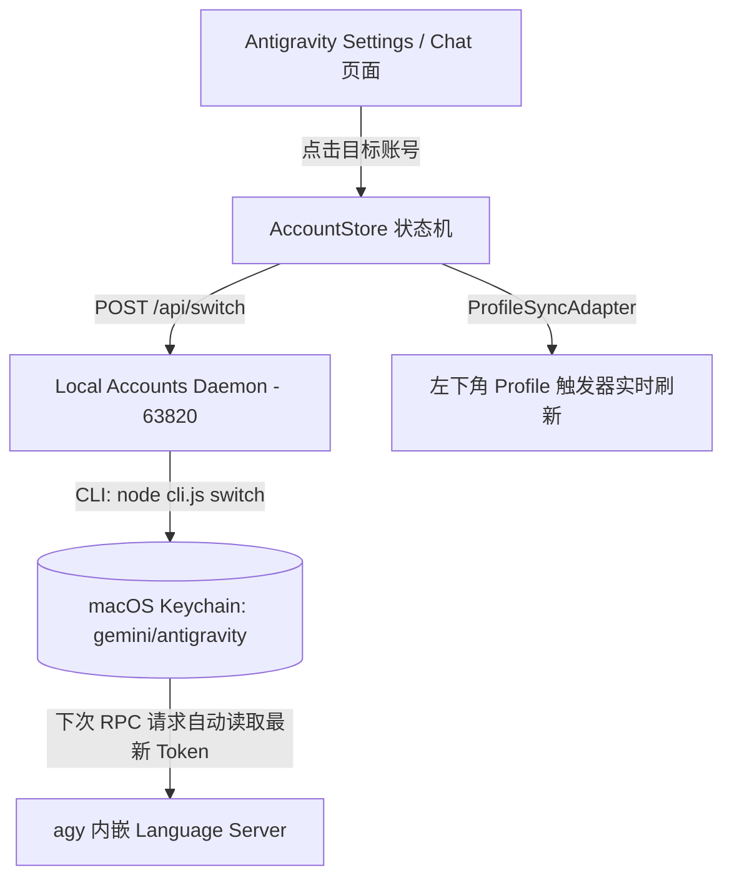

# Google Antigravity VS Code 多账号增强实验联调指南

状态：实验联调文档，不能作为生产交付证明。跨项目职责、认证载体和已验收能力以 `agent-hub-accounts` 文档为准；本文中的“无感切换”只有在 `RESTART_LS` 和账号身份重新校验完成 live canary 后才能标记为已验证。

## 1. 实验范围

本项目正在验证将多账号 UI 注入 Antigravity Webview 的可行性。源码包含 Settings 页面、左下角 Profile 入口、本地 Daemon 和 Accounts CLI 桥接；IDE 重新认证、`RESTART_LS`、账号身份复核和端到端恢复尚未形成验收闭环。

当前源码包含：

- Antigravity 风格的实验 UI；
- 对 `agent-hub-accounts` 的账号列表、切换、登录、连接、删除和额度刷新调用；
- LocalStorage 展示缓存和失败回滚；
- CDP 注入与本地 Daemon。

这些源码事实不证明 IDE 账号已经完成无感切换，也不证明 UI 中的档位和聚合额度已与服务端身份完成一致性校验。

---

## 2. 核心架构与运行原理



### 2.1 关键设计原则
1. **双层 Webview 沙箱穿透**：
   - 官方插件结构为：外层 `bridge.js` + 内层独立 iframe（`http://127.0.0.1:<port>/settings-standalone`）；
   - 增强逻辑精准装配在内层 React SPA 环境中，保证对 DOM 树与状态机的无缝绑定。
2. **零暴力中断保障**：
   - 避免操作系统级杀死 `agy` 进程导致 WebSocket 管道破裂（避免 `Connecting to Remote Antigravity tunnel` 错误）；
   - 采用持久化 Keychain 槽位覆盖机制。

---

## 3. 代码库结构与核心文件说明

项目仓库核心模块结构：

| 文件路径 | 模块名称 | 核心职责与实现逻辑 |
| :--- | :--- | :--- |
| `src/runtime/ui/accountPopup.ts` | 多账号弹窗组件 | 渲染 1:1 磨砂浮窗、展示所有账号状态（Pro/Free、剩余配额、异常标注）、拦截并分发切号点击事件 |
| `src/runtime/ui/settingsEnhancer.ts` | Settings 页面增强看板 | 在官方设置页的 `Models & Usage` 区域顶部挂载「Connected Subscriptions」网格卡片与刷新按钮 |
| `src/runtime/adapters/semanticLocator.ts` | 强语义定位器 | 采用邮箱正则与 AST 节点回溯算法，精准定位左下角 Profile 触发容器并计算绝对贴靠坐标 |
| `src/runtime/adapters/profileSyncAdapter.ts` | 状态同步适配器 | 切号后即时将左下角 Profile 胶囊的头像、名称和邮箱同步为当前激活账号，严格隔离侧边栏菜单 |
| `src/runtime/services/accountStore.ts` | 账户数据与切号服务 | 负责 LocalStorage 缓存、与本地 Daemon 通信获取实时配额（`route` / `quota`）及触发切号 |
| `src/daemon/` | 本地桥接服务 (Port 63820) | Node.js HTTP 桥接层，封装调度底层凭据管理与账号切换 |

---

## 4. 实验联调流程

以下步骤只用于本地实验，不是生产 SOP。界面状态变化不代表底层 IDE 身份已经切换成功，必须以重新连接后的服务端账号身份为准。

### 4.1 如何在界面中使用多账号

1. **展开账号列表**：
   - 在 VS Code 中打开 Antigravity 设置页或聊天界面；
   - 点击左下角的个人 Profile 头像或邮箱区域，检查实验账号浮窗是否挂载。
2. **切换激活账号**：
   - 在弹窗中点击目标账号卡片；
   - 界面会先乐观更新当前项、配额和 Profile 文本；Daemon 调用失败时应回滚。该 UI 更新不能作为 IDE 身份切换证明。
3. **在 Settings 页面查看总览**：
   - 打开 Antigravity Settings 页面并进入 **Models** 模块；
   - 卡片锚定在**页面底部**(所有原生配额区块之后),不是顶部；缓存陈旧或账号存在异常时不得解释为实时额度。

### 4.2 如何接入/添加新 Google 账号

> 本节曾描述"点 `+ Add another subscription` → 用 agy TUI 登录 → 手动 `connect`"的旧流程,**已整体作废**。当前流程见 [`FLOWS.md`](./FLOWS.md) 场景 3。

要点:入口是弹窗底部的 **Add new account**,全程在编辑器内完成,不需要开 Terminal,也不需要手动执行 `connect`——`begin` / `finish` 由 daemon 负责。核验仍以 `agent-hub-accounts list` 为准,不能只看 Enhancer UI。

---

## 5. 常见运维与故障排查

### 5.1 页面出现白屏或隧道断开（`Connecting to Remote Antigravity tunnel`）
- **可能原因**：CDP 端口不可用、目标 iframe 重建、Vite 服务不可用或 `agy` Hub 已退出；
- **检查方式**：先检查 Enhancer Daemon、CDP target 和 Vite 服务，再决定是否执行 `Developer: Reload Window`。

### 5.2 切号后提示需重新登录（Sign in with Google）
- **可能原因**：IDE 没有重新读取活动凭据、目标账号 Session 无效，或 Accounts 与 IDE 使用了不同认证载体；
- **恢复方式**：先停止继续切号，再用已安装的 Accounts CLI 恢复确认可用的账号：
  ```bash
  agent-hub-accounts switch <账号邮箱或序号>
  ```
  恢复 CLI 活动账号不等于 IDE 已恢复；随后仍需重新连接并核对 IDE 服务端身份。
